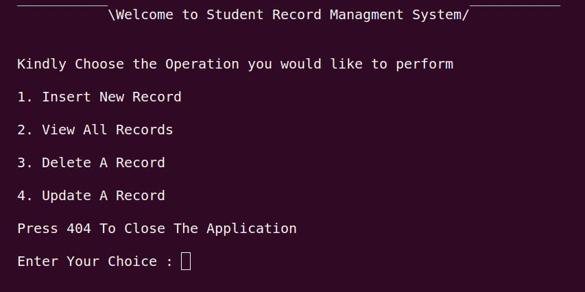
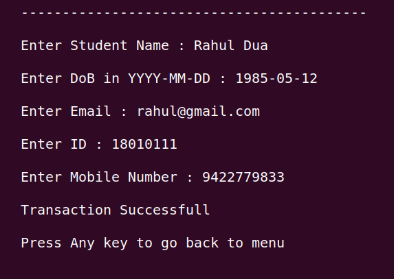
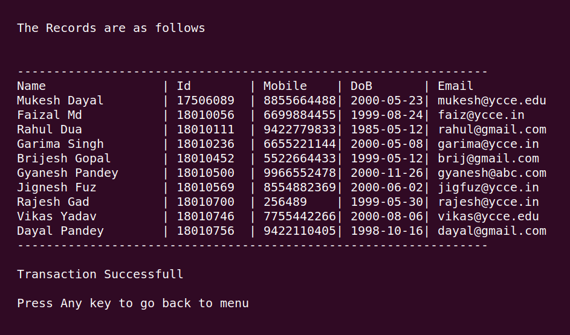
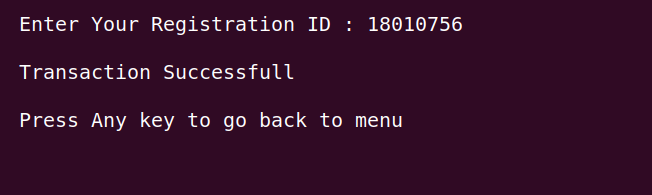
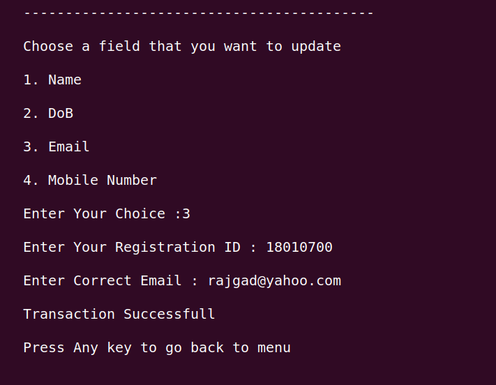

# Student Record Managment Using C++ and MYSQL DataBase

## This Application Perform Basic CRUD operations Create,Read,Update and Delete Using C++ and MYSQL DB

- Prerequisite Installations Required : g++ compiler,sql api library,mysql

- Specification of Relation in Database

```sql

CREATE TABLE Student(
    name varchar(20) NOT NULL,
    id decimal(10,0) NOT NULL,
    mobile decimal(10,0) NOT NULL,
    dob date NOT NULL,
    email varchar(20) NOT NULL
)

```

- Compiling the Program and Creating a Executable File

```bash
    g++ source/*.cpp implementation/*.cpp -L/usr/include/mysql/mysql -lmysqlclient
```

-   SnapShots of Application Features
#### Main Menu 


#### Inserting Record to System 


#### View All Records 


#### Delete A Record

    
#### Update Data 


    
